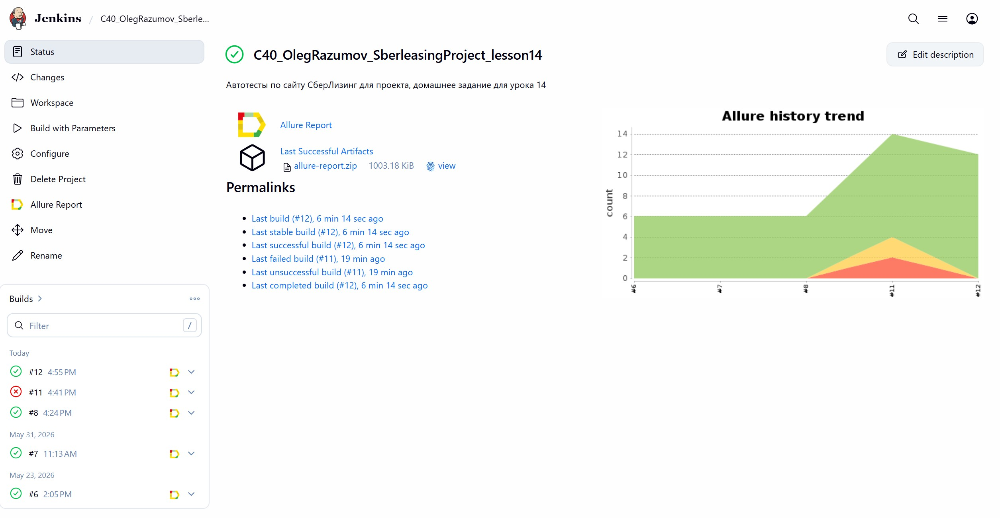
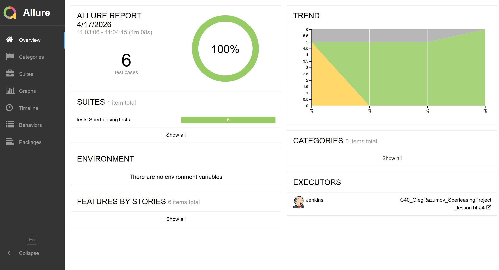
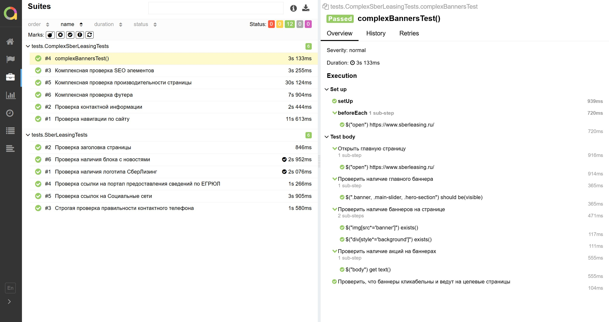
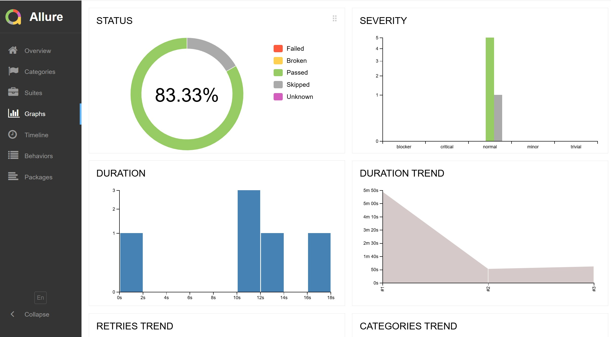
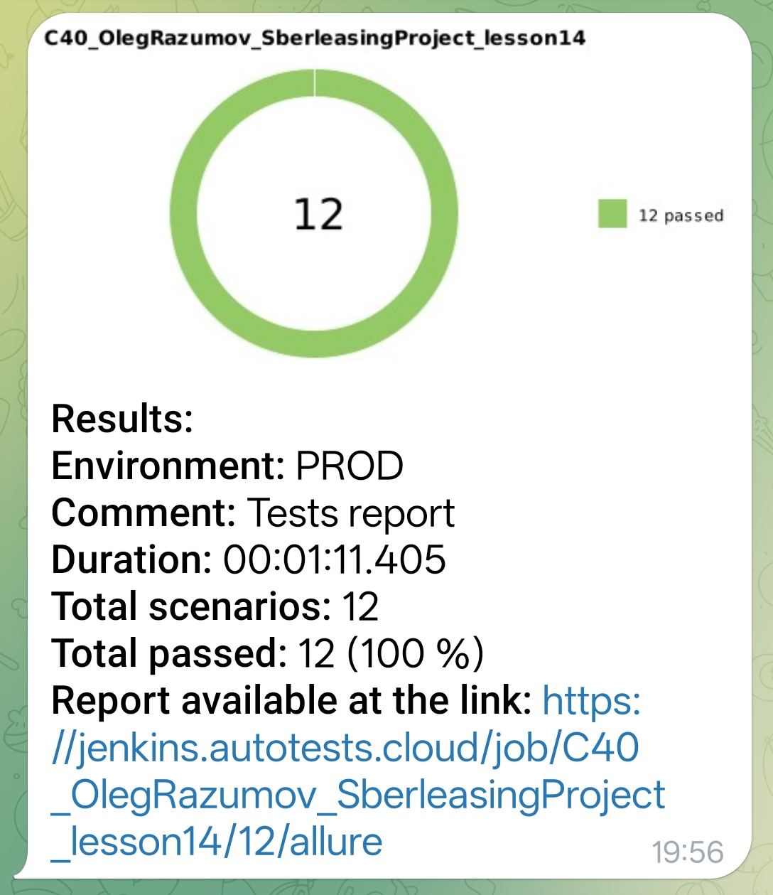
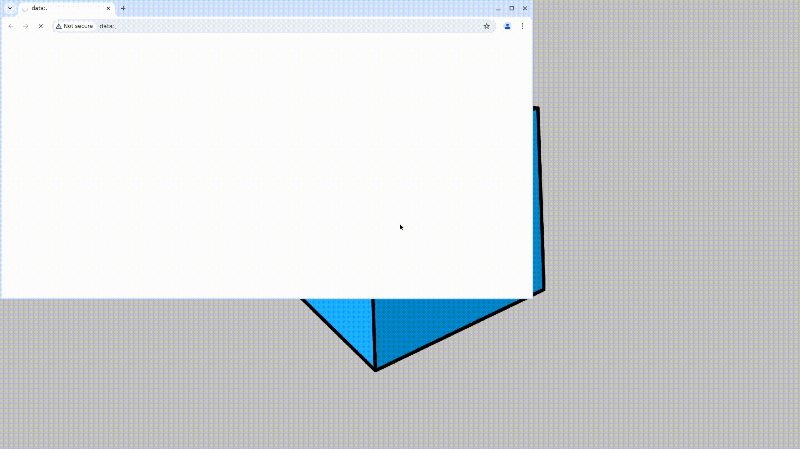

#    Проект по автоматизации тестирования  компания СберЛизинг  

> Проект включает в себя UI-автотесты для комапнии СберЛизинг, с использованием современного стека технологий, интеграцией в CI/CD процессы и подключением отчётности.

## 🔗 Ссылки на проект и инфраструктуру
* [Тестируемый сайт](https://www.sberleasing.ru)
* [Сборка в Jenkins](https://jenkins.autotests.cloud/job/C40_OlegRazumov_SberleasingProject_lesson14/)
* [Отчет в Allure Report](https://jenkins.autotests.cloud/job/C40_OlegRazumov_SberleasingProject_lesson14/allure/)

## 🛠 Технологический стек

  
  
  
  
  
  
  
  
 
   
  

* **Язык**: Java 17
* **Фреймворки**: Selenide, JUnit 5
* **Сборка**: Gradle 8.x
* **Отчетность**: Allure Report
* **Инфраструктура**: Jenkins, Selenoid
* **Уведомления**: Telegram Bot

---

##    Сборка в Jenkins

Для запуска сборки необходимо перейти в раздел <code>Buld with Parametrs</code>, выбрать параметры экрана, браузер и нажать кнопку <code>Build</code>.

---
##  Мониторинг и отчетность

После выполнения сборки, в блоке <code>История сборок</code> напротив номера сборки появятся значки <code>Allure Report</code>, при клике на которые откроется страница с сформированным html-отчетом и тестовой документацией соответственно.

 
 
 

---

##  Уведомления в Telegram
Так же настроена отправка отчётов прохождения тестов, в Telegram-bot.

  

---

###  Видео выполнения тестов
В отчетах Allure для каждого теста прикреплен видео-скриншот прохождения теста.

  
  </img>

---

